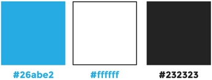
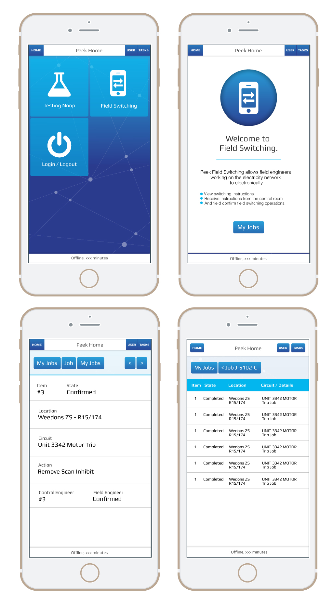

.. _design:

======
Design
======


Branding
--------


Logo
````


Colours
```````




Fonts
-----

Source (Google fonts): `Play <https://fonts.google.com/specimen/Play>`_


Platform
--------


Operating system
````````````````

Targeted at iOS but must also operate on Android and Microsoft.


Devices
```````

*  iPHONE 6+ (!important)

*  All major desktop and tablets


Design Overview
---------------

Wireframe
`````````

General wireframe layout based on bootstrap. Use current layout in design phase.



Design requirements
```````````````````

#.  All screens do not need to have the same background

#.  Use a video background on home screen only

#.  Data must be

    #.  Readable in daylight

    #.  Without transparent backgrounds

#.  Other screens must have static background to avoid distractions

#.  Large icons with text in the icons on home page

#.  Home page icons need to be more like apple icons

#.  Home page design must be impressive

#.  Use Nodal background as used in Peek App Branding

#.  Each icon on the home screen represents and App / Plugin and the background image
    for each App can change when a user clicks into it, hence having its own subtle
    branding but still share allot of common elements in the entire app.

Design restrictions
```````````````````

#.  Design must not be dark or have a dark background
