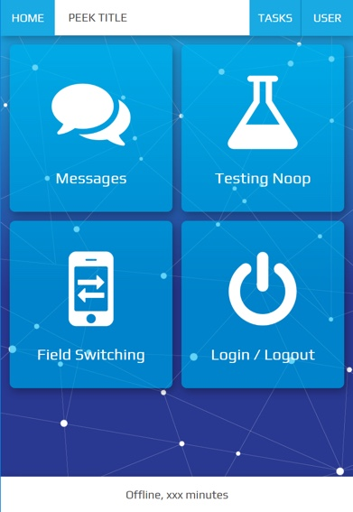
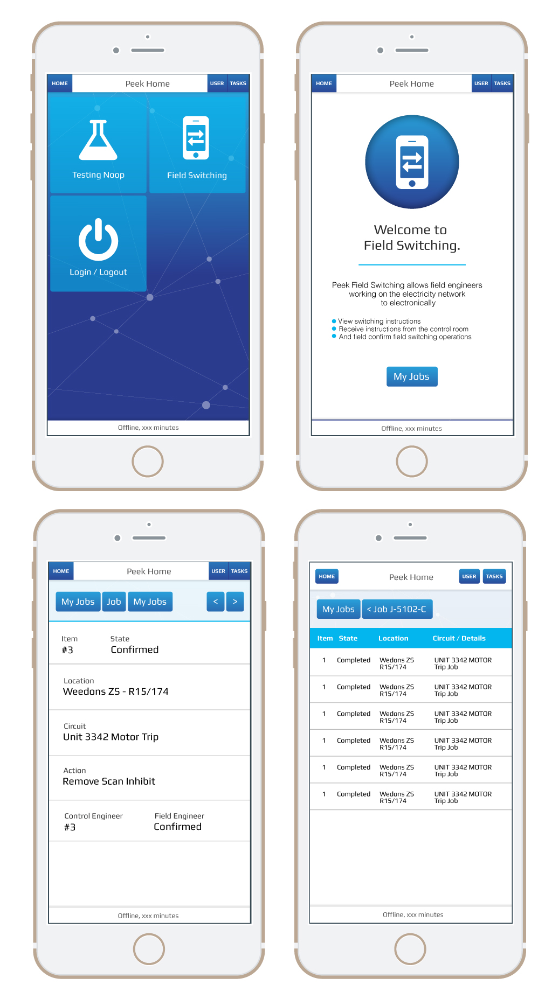
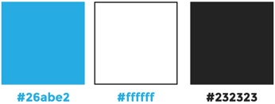

.. _design_guidelines:

=================
Design Guidelines
=================


Design Objective
----------------

The objective of this project is to stylise the existing layout to make it very
impressive without changing the HTML / javascript of a page to a large extent. The job
mainly involves CSS/SCSS upgrade to the base Bootstrap theme.

This app will be viewed predominately during the day. The design and layout must be
clear to read in very bright sunlight.

Web app screenshot:




Design Overview
---------------



Design requirements
```````````````````

#.  Data must be

    #.  Readable in daylight

    #.  Without transparent backgrounds

#.  Large icons with text in the icons on home page

#.  Home page icons need to be more like apple icons

#.  Home page design must be impressive

#.  All screens do not need to have the same background

#.  Other screens must have static background to avoid distractions

#.  Use Nodal background as used in Peek App Branding

#.  Each icon on the home screen represents and App / Plugin and the background image
    for each App can change when a user clicks into it, hence having its own subtle
    branding but still share allot of common elements in the entire app.


Design restrictions
```````````````````

#.  Design must not be dark or have a dark background


Branding
--------


Logo
````


Colours
```````




Fonts
-----

Source (Google fonts): `Play <https://fonts.google.com/specimen/Play>`_


Platform
--------


Operating system
````````````````

iOS, Android and Web.

Future development: Microsoft app.


Devices
```````

The application has been developed for screens of a resolution greater than, 1136 x 640
pixels.  This is the iPhone 5 resolution.

.. note:: The application will function on devices with lower resolution but may not
  display correctly.
