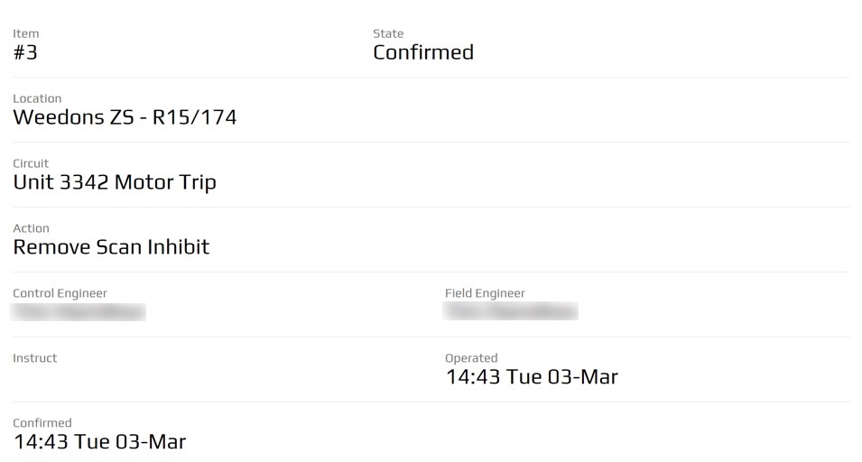

.. _details_section:

===============
Details Section
===============

The Details Section presents data (text, numbers, images, or other data) of importance
to the Peek app user.
It involves enumerating important characteristics, emphasizing significant figures and
identifying important features of data.

Ideally this section will be configured to present only required data to the user
reducing the need for the Peek app user scrolling / filtering through unnecessary data.
Prioritises information by providing focus to the values.

Uses:

*  Instructions

*  Itinerary

*  Form Data (displaying not editing)

Any plugin Screen will be able to use the :code:`.peek-details-section` attributes.

Classes
-------

The :code:`.peek-details-section` class contain the classes specific to a Details
Section.

::

        .peek-details-section {
        /* Contains the Details Section looks classes */
            ...

            .details-section-title {
            /*
                Contains the title attributes unique to the Details Section
                this text will have the text-muted effect
            */
                ...

            }
            .details-section-value {
            /*
                Contains the value attributes unique to the Details Section
                text to have the focus of attention
            */
                ...
                .multiline {
                /*
                    For HTML.
                    This class is to be used for multi-line support.
                    Whitespace is preserved by the browser. Text will wrap when
                    necessary, and on line breaks.  Must be in a span
                */
                    ...

                }
                .editable {
                /*
                    Contains the editable attributes unique to the .details-section-value class
                */
                    ...

                    .editable-md {
                      /*
                          Contains the height property for the .editable class
                      */
                        ...

                    }

                    .editable-lg {
                      /*
                          Contains the height property for the .editable class
                      */
                        ...

                    }
                }

                //Select lists
                    ...

                }

                //Single line inputs
                    ...

                }

                //Multi line inputs
                    ...

                }
            }

            .details-section-btn {
              /*
                  Contains the generic button attributes unique to the .peek-details-section class
              */
                ...

            }

            .btn-group {

                .details-section-btn {
                  /*
                    Contains the generic button attributes inside a .btn-group unique to the .peek-details-section class
                  */
                    ...

                }

                .details-section-btn-divider-left {
                  /*
                    Contains the button divider attributes inside a .btn-group unique to the .peek-details-section class
                  */
                    ...

                }
            }

            .details-section-btn-disabled {
            /*
                Contains the button disabled attributes .peek-details-section class
            */

            }
        }

SCSS Files
----------

The Details style classes are found in the
:file:`_details_section.scss`.

The Details Section HTML layout classes are found in the
:file:`_details_section.web.scss`.

The Details Section NativeScript layout classes are found in the
:file:`_details_section.ns.scss`.

HTML
----

The Details Section uses Bootstraps `Grid System <http://getbootstrap.com/css/#grid>`_.

A Container contains row's.  Row create horizontal groups of columns, rows are made up of
12 columns.  Content is placed in columns and only column's can be immediate children of
row's.

Refer to the `Grid System <http://getbootstrap.com/css/#grid>`_ for more information
about creating page layouts using the Bootstrap grid system.

Below is the HTML code extract of three rows: ::

        

            

                <!--Displayed form data -->
                

                    

                        

                            Control Engineer
                        

                        

                            {{job.activeControlEngineer}}
                        

                    

                    

                        

                            Field State
                        

                        

                            {{job.fieldStatus.niceName}}
                        

                    

                

                

                

                    

                        

                            Name
                        

                        

                            {{job.jobName}}
                        

                    

                

                

                

                    

                        
Work Description

                        

                            {{job.workSummary}}
                        

                    

                

                

NativeScript
------------

The Details Section uses the
`NativeScript recursive layout system <https://docs.nativescript.org/ui/layouts>`_.

The `StackLayout <https://docs.nativescript.org/ui/layout-containers#stacklayout>`_
defines the horizontal groups of
`GridLayout <https://docs.nativescript.org/ui/layout-containers#gridlayout>`_ Content
is placed in the GridLayout that is the immediate child of the StackLayout.

Below is the NativeScript code extract of two rows from the screenshot in the
beginning of the :ref:`details_section`: ::

        <StackLayout class="peek-details-section">
            <GridLayout rows="auto, auto" columns="*, *">
                <!-- Column 1 -->
                <Label row="0" col="0" class="details-section-title"
                       text="Control Engineer"></Label>
                <Label row="1" col="0" class="details-section-value" textWrap="true"
                       [text]="job.activeControlEngineer"></Label>
                <!-- Column 2 -->
                <Label row="0" col="1" class="details-section-title"
                       text="Field State"></Label>
                <Label row="1" col="1" class="details-section-value"
                       [text]="job.fieldStatus.niceName"></Label>
            </GridLayout>

            <!-- Spacer -->
            <Label class="h3" text=""></Label>

            <!--
-->
            <GridLayout rows="auto, auto" columns="*">
                <Label row="0" col="0" class="details-section-title" text="Name"></Label>
                <Label row="1" col="0" class="details-section-value" textWrap="true"
                       [text]="job.jobName"></Label>
            </GridLayout>

            <!-- Spacer -->
            <Label class="h3" text=""></Label>

            <!--
-->

