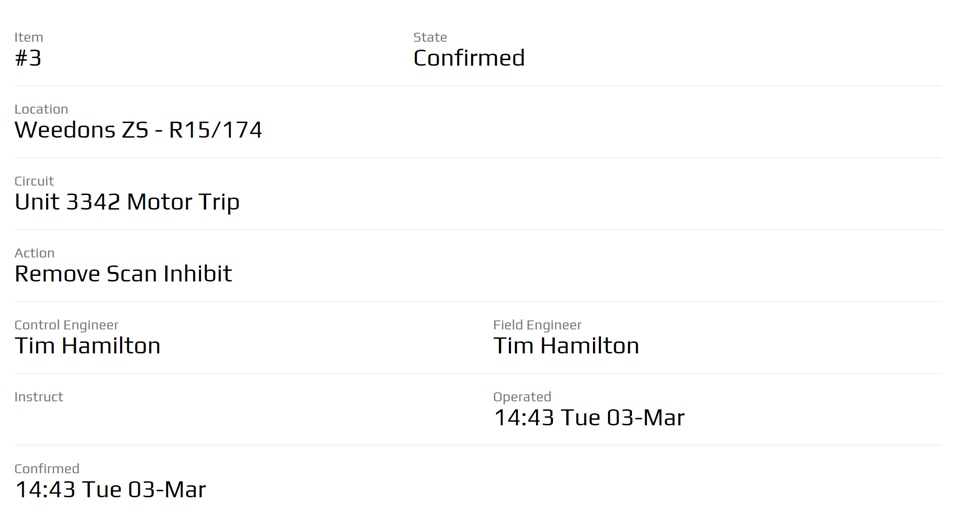

.. _details_screen:

==============
Details Screen
==============

Any plugin screen will be able to use the :code:`.peek-details-screen` attributes.


Looks Classes
-------------

The Details looks classes are found in the :file:`_details_screen.scss`.

.. _details_screen_details_screen:

Details Screen :code:`.peek-details-screen`
```````````````````````````````````````````



The :code:`.peek-details-screen` class contain the classes specific to a Details
Screen.

::

        .peek-details-screen{
        <!-- Contains the Details Screen looks classes -->

            .data-row{
            <!-- Contains the row looks attributes unique to the Details Screen -->

                ...

                .data-title{
                <!-- Contains the title looks attributes unique to the .data-row class -->

                    ...

                }

                .data-value{
                <!-- Contains the value looks attributes unique to the .data-row class -->

                    ...

                }
            }
        }


Layout
------

HTML:

The Details Screen HTML layout classes are found in the
:file:`_details_screen.web.scss`.

NativeScript:

The Details Screen NativeScript layout classes are found in the
:file:`_details_screen.ns.scss`.


Code Extract
------------

Below is the HTML code extract of the first two rows from the
:ref:`details_screen_details_screen`: ::

        <div class="peek-details-screen">
          <div class="data-row">
              <div class="form-group col-xs-5">
                  <div class="data-title">
                    Item

                  </div>
                  <div class="data-value">
                    #3

                  </div>
              </div>
              <div class="form-group col-xs-7">
                  <div class="data-title">
                    State

                  </div>
                  <div class="data-value">
                    Confirmed

                  </div>
              </div>
          </div>

          <div class="data-row">
              <div class="form-group col-xs-12">
                  <div class="data-title">Location</div>
                  <div class="data-value">Weedons ZS - R15/174</div>

              </div>
          </div>
        </div>

