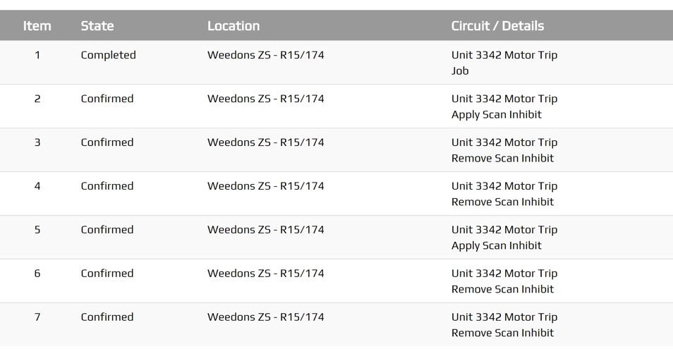

.. _tables_screen:

=============
Tables Screen
=============

Any plugin screen will be able to use the :code:`.peek-tables-screen` attributes.


Looks Classes
-------------

The Tables looks classes are found in the :file:`_tables_screen.scss`.

.. _tables_screen_tables_screen:

Tables Screen :code:`.peek-tables-screen`
`````````````````````````````````````````



The :code:`.peek-tables-screen` class contain the classes specific to a Tables
Screen.

::

        .peek-tables-screen{
        <!-- Contains the Tables Screen looks classes -->
            ...

            .table{
            <!-- Contains the table looks attributes unique to the Tables Screen -->
                ...

                .table-head{
                <!-- Contains the table header looks attributes unique to the .table class -->
                    ...

                    .table-head-cell{
                    <!-- Contains the table head cell looks attributes unique to the .table-head class -->
                        ...

                    }
                }
                .table-row{
                <!-- Contains the table row looks attributes unique to the .table class -->
                    ...

                    .table-row-cell{
                    <!-- Contains the table row cell looks attributes unique to the .table-row class -->
                        ...

                    }
                }
            }
        }


Layout
------


HTML
````

The Tables Screen HTML layout classes are found in the
:file:`_tables_screen.web.scss`.


NativeScript
````````````

The Tables Screen NativeScript layout classes are found in the
:file:`_tables_screen.ns.scss`.


Code Extract
------------

Below is the HTML code extract of table header and first two rows from
:ref:`tables_screen_tables_screen`: ::

        <div class="peek-tables-screen">
          <table class="table">
              <thead>
                  <tr class="table-head">
                      <th class="table-head-cell">Item</th>
                      <th class="table-head-cell">State</th>
                      <th class="table-head-cell">Location</th>
                      <th class="table-head-cell">Circuit / Details</th>
                  </tr>
              </thead>
              <tbody>

                  <tr class="table-row">
                      <td class="table-row-cell">1</td>
                      <td class="table-row-cell">Completed</td>
                      <td class="table-row-cell">Weedons ZS - R15/174</td>
                      <td class="table-row-cell">Unit 3342 Motor Trip
                          <br> Job</td>
                  </tr>
                  <tr class="table-row">
                      <td class="table-row-cell">2</td>
                      <td class="table-row-cell">Confirmed</td>
                      <td class="table-row-cell">Weedons ZS - R15/174</td>
                      <td class="table-row-cell">Unit 3342 Motor Trip
                          <br> Apply Scan Inhibit</td>
        
                  </tr>
              </tbody>
          </table>
        </div>
