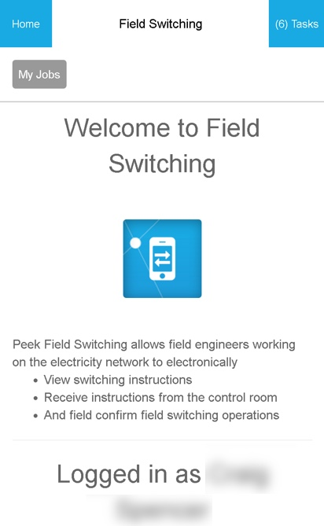

.. _information_section:

===================
Information Section
===================

The Information Section is used as a landing page to show useful information before
presenting Plugin Screens.  The useful information can include a plugin description and
information from other plugins relevant to the plugin.

Any plugin Screen will be able to use the :code:`.peek-information-section` attributes.

Classes
-------

The :code:`.peek-information-section` class contain the classes specific to a Information
Section.

::

        .peek-information-section{
        /*
            Contains the Information Section classes
        */
            ...

            information-section-icon{
            /*
                Contains the icon attributes unique to the Details Section
            */
                ...

            }
            information-section-title{
            /*
                Contains the title attributes unique to the Details Section
            */
                ...

            }
            information-section-description{
            /*
                Contains the description attributes unique to the Details Section
            */
                ...

            }
            information-section-btn{
            /*
                Contains the button attributes unique to the Details Section
            */
                ...

            }
            information-section-user-status{
            /*
                Contains the user status text attributes unique to the Details Section
            */
                ...

            }

SCSS Files
----------

The Information style classes are found in the :file:`_information_section.scss`.

The Information Section HTML layout classes are found in the
:file:`_information_section.web.scss`.

The Information Section NativeScript layout classes are found in the
:file:`_information_section.ns.scss`.

HTML
----

::

        

            
            
Welcome to Field Switching.

            

                Peek Field Switching allows field engineers working on the electricity
                network to electronically
                <ul>
                    <li>View switching instructions</li>
                    <li>Receive instructions from the control room</li>
                    <li>And field confirm field switching operations</li>
                </ul>
            

            <button class="information-section-btn" ng-reflect-router-link="./joblist">My Jobs &gt;
            </button>
            <i class="information-section-icon fa fa-user" aria-hidden="true"></i>
            
Logged in as Tim Hamilton

        

