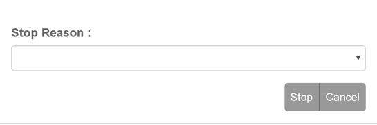

.. _mobile_dialog_section:

=====================
Mobile Dialog Section
=====================

The Mobile Dialog Section presents inputs and/or options to the Peek app user.
It can involve a select drop down with a confirm and cancel buttons as per the example
below.

The input types can be customised by the developer depending on the plugin requirements.

Uses:

*  List Selection

*  Text Input

*  File Select

*  Action Confirm

Any plugin screen dialog will be able to use the :code:`.mobile-dialog` attributes.

Classes
-------

The :code:`.mobile-dialog` class contain the classes specific to a Mobile Dialog Section.

::

        .mobile-dialog {
        /* Contains the Mobile Dialog Section looks classes unique for mobile devices */
            ...

            .dialog-label {
            /*
                Contains the label attributes unique to the Mobile Dialog Section
            */
                ...

            }
            .dialog-selector {
            /*
                Contains the selector attributes unique to the Mobile Dialog Section
            */
                ...

            }
            .dialog-action-btn {
            /*
                Contains the action button attributes unique to the Mobile Dialog Section
            */
                ...

            }
        }

SCSS Files
----------

The Mobile Dialog Section style classes are found in the
:file:`_mobile_dialog_section.scss`.

The Mobile Dialog Section HTML layout classes are found in the
:file:`_mobile_dialog_section.web.scss`.

The Mobile Dialog Section NativeScript layout classes are found in the
:file:`_mobile_dialog_section.ns.scss`.

HTML
----

The Mobile Dialog Section uses Bootstraps `Forms <http://getbootstrap.com/css/#forms>`_.

Refer to the `Forms <http://getbootstrap.com/css/#forms>`_ for more information
about creating Forms using Bootstrap.

Below is the HTML code extract op-confirm.component shown in the image at the top of,
:ref:`mobile_dialog_section`: ::

        

            

                

                    
Operation Date / Time :
                    

                    <input id="operationDate" class="dialog-selector form-control"
                           [(ngModel)]="inputData.operationDate" ng2-datetime-picker
                           close-on-select="false"
                           date-format="DD-MMM-YYYY HH:mm"/>

                

                

                    
Request Further Instructions :
                        <button class="dialog-action-btn btn-sm"
                                (click)="inputData.requestFurtherInstructions=!inputData.requestFurtherInstructions"
                                [class.btn-success]="inputData.requestFurtherInstructions"
                                type="button">{{inputData.requestFurtherInstructions ? "Yes" :
                            "No"}}
                        </button>
                    

                

                <!--BEGIN HANDBACK DIALOG -->
                

                    <Button class="dialog-action-btn" (click)="webConfirmClicked()">
                        {{inputData.actionName}}
                    </Button>

                    <Button class="dialog-action-btn" (click)="cancelClicked(false)">Cancel
                    </Button>
                

            

        

NativeScript
------------

The Mobile Dialog Section uses the
`NativeScript recursive layout system <https://docs.nativescript.org/ui/layouts>`_.

The `StackLayout <https://docs.nativescript.org/ui/layout-containers#stacklayout>`_
defines the horizontal groups of
`GridLayout <https://docs.nativescript.org/ui/layout-containers#gridlayout>`_ Content
is placed in the GridLayout that is the immediate child of the StackLayout.

Refer to the
`ListPicker <https://docs.nativescript.org/angular/code-samples/ui/listpicker.html#listpicker>`_
for more information about using NativeScript ListPicker.

Below is the NativeScript code extract op-confirm.component: ::

        <StackLayout class="mobile-dialog">
            <StackLayout class="input-field" horizontalAlignment="stretch">

                <GridLayout rows="auto, auto" columns="auto, auto">
                    <Label row="0" col="0" colspan="2"
                           class="dialog-label" text="Operation Date / Time :"></Label>
                    <!--<GridLayout columns="*,*" rows="auto">-->
                    <DatePicker class="dialog-selector" row="1" col="0" #datePicker
                                (loaded)="nsConfigureDate(datePicker)"
                                (dateChange)="nsDateChanged($event)">
                    </DatePicker>
                    <TimePicker class="dialog-selector" row="1" col="1" #timePicker
                                (loaded)="nsConfigureTime(timePicker)"
                                (timeChange)="nsTimeChanged($event)">

                    </TimePicker>
                </GridLayout>

                <!--</GridLayout>-->

                <WrapLayout>
                    <Label class="dialog-label"
                           text="Request Further Instructions : " textWrap="true"
                    ></Label>
                    <Switch #furtherInstruct
                            [checked]="inputData.requestFurtherInstructions"
                            (checkedChange)="inputData.requestFurtherInstructions = furtherInstruct.checked"
                    ></Switch>
                </WrapLayout>
            </StackLayout>

            <GridLayout columns="*,*" rows="auto">
                <Button class="dialog-action-btn" col="0" [text]="inputData.actionName"
                        (tap)="nsConfirmClicked()"></Button>
                <Button class="dialog-action-btn" col="1" text="Cancel"
                        (tap)="cancelClicked(true)"></Button>
            </GridLayout>

        </StackLayout>

