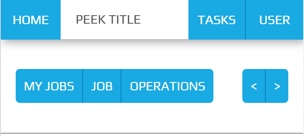

.. _navigation_section:

==================
Navigation Section
==================

The Navigation Section is positioned below the :ref:`title_bar`, above the plugin
screen and contains buttons that route to other screens or toggle the data presented.

The sample below shows an example of breadcrumbs navigation (left) and forward / next and
back / previous buttons (right).

The Navigation Section serves as primary navigation routes for the active plugin.

If a Navigation Section is required it is constructed by the plugin screen.

Navigation Types:

*  Breadcrumbs
*  Pagination
*  forward and / or back, next and / or previous

The buttons remain a fixed size throughout a responsive lifecycle.  The buttons are
sized around the text they contain.

.. note:: The buttons require a different theme to the :ref:`title_bar` and generic
   peek theme buttons.

Classes
-------

The :code:`.peek-nav-section` class contains the looks classes specific to the
Navigation Section.

::

        .peek-nav-section{
        /* Contains the Navigation Section attributes */
          ...

          .nav-section-btn{
          /* Contains the Button attributes unique to the Navigation Section */
            ...

          }
        }

        .peek-nav-bar-padding {
        /* Provides padding for the screen under the Navigation Section */
          ...
        }

SCSS Files
----------

The Navigation Section style classes are found in the
:file:`_navigation_section.scss`.

The Navigation Section HTML layout classes are found in the
:file:`_navigation_section.web.scss`.

The Navigation Section NativeScript layout classes are found in the
:file:`_navigation_section.ns.scss`.

HTML
----

The :code:`peek-nav-section` is to be included before the code of the plugin screen
requiring the Nav Bar.

::

        

            <!--
                The following 'div' groups button to the left of the Nav Bar.
                Can contain one to many buttons
            -->
            

                <Button class="nav-section-btn"
                        role="group"
                        (click)="navToMyJobs()">
                    My Jobs
                </Button>
                <Button class="nav-section-btn"
                        role="group"
                        (click)="navToJob()">
                    Job
                </Button>
                <Button class="nav-section-btn"
                        role="group"
                        (click)="navToOperations()">
                    Operations
                </Button>
            

            <!--
                The following 'div' groups button to the right of the Nav Bar.
                Can contain one to many buttons
            -->
            

                <button class="nav-section-btn"
                        role="group"
                        [disabled]="!lastOperationEnabled()"
                        (click)="navToLastOperation()">
                    &lt;
                </button>
                <button class="nav-section-btn"
                        role="group"
                        [disabled]="!nextOperationEnabled()"
                        (click)="navToNextOperation()">
                    &gt;
                </button>

                <!-- CONFIRM THE OPERATION -->
                <Button class="nav-section-btn"
                        *ngIf="confirmEnabled()"
                        (click)="confirmOp()">
                    Confirm
                </Button>
            

        

        

        <!-- This div provides padding for the screen under the Navigation Section -->

        

NativeScript
------------

The :code:`peek-nav-section` is to be included before the code of the plugin screen
requiring the Nav Bar.

::

        <GridLayout class="peek-nav-section"
                    rows="auto" columns="auto, *, auto"
                    *ngIf="!confirmDialogShown()">
            <GridLayout rows="auto" columns="auto, auto, auto, auto"
                        row="0" col="0">
                <Button class="nav-section-btn"
                        row="0" col="0"
                        text="My Jobs"
                        (tap)="navToMyJobs()"></Button>
                <Button class="nav-section-btn"
                        row="0" col="1"
                        text="Job"
                        (tap)="navToJob()"></Button>
                <Button class="nav-section-btn"
                        row="0" col="2"
                        text="Operations"
                        (tap)="navToOperations()"></Button>
                <Button class="nav-section-btn"
                        row="0" col="3"
                        [text]="Confirm"
                        *ngIf="confirmEnabled()"
                        (tap)="confirmOp()"></Button>
            </GridLayout>
            <GridLayout rows="auto" columns="auto, auto"
                        row="0" col="2">
                <Button class="nav-section-btn"
                        row="0" col="0"
                        text="<"
                        [isEnabled]="lastOperationEnabled()"
                        (tap)="navToLastOperation()"></Button>
                <Button class="nav-section-btn"
                        row="0" col="1"
                        text=">"
                        [isEnabled]="nextOperationEnabled()"
                        (tap)="navToNextOperation()"></Button>
            </StackLayout>
        </GridLayout>
        <StackLayout class="hr-dark"></StackLayout>

