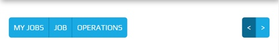
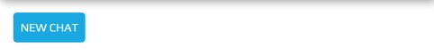

.. _navigation_section:

==================
Navigation Section
==================

Navigation Section is dynamic and exists if required by the plugin.  The contents of the
Navigation Section is constructed from the plugin.

The Navigation Section is located below the :ref:`title_section`, above the screen.

.. image:: ./navigation_section.web.jpg
   :align: center

The buttons remain a fixed size throughout a responsive lifecycle.  The buttons are
sized around the text they contain.

.. note:: The buttons require a different theme to the :ref:`title_section`.


Looks Classes
-------------

The :code:`.btn-group` and :code:`.btn` classes are used throughout Peek.
These looks classes attribute changes are found in :file:`_bootstrap_adjustments.scss`.

::

        .peek-nav-section{
        /* Contains the Navigation Section looks attributes */
            ...

        }
        .btn-group{
        /* Contains the Button Group looks attributes */
            ...

        }
        .btn{
        /* Contains the Button looks attributes */
            ...

        }


Layout
------


HTML
````

The Navigation Section HTML layout classes are found in the
:file:`_navigation_section.web.scss`.


NativeScript
````````````

The Navigation Section NativeScript layout classes are found in the
:file:`_navigation_section.ns.scss`.


Display Samples
---------------


HTML
````

The following example shows a button group :code:`.btn-group` on the left and a button
group on the right.

::

        <div class="btn-group pull-left" role="group">
            <button class="btn" role="group">My Jobs</button>
            <button class="btn" role="group">Job</button>
            <button class="btn" role="group">Operations</button>
        </div>
        <div class="btn-group pull-right" role="group">
            <button class="btn" role="group">&lt;</button>
            <button class="btn" role="group">&gt;</button>
        </div>




The following example shows a button group on the left.

::

        <div class="btn-group" role="group">
            <button class="btn">My Jobs</button>
            <button class="btn">&lt; Job J-5102-C</button>
        </div>


The following example shows a button :code:`.btn` on the left.

::

        <button class="btn">New Chat</button>



