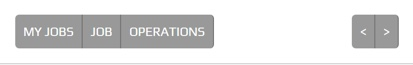

.. _navigation_section:

==================
Navigation Section
==================

The Navigation Section is positioned below the :ref:`title_bar`, above the plugin
screen and contains buttons that route to other screens or toggle the data presented.

The sample below shows an example of breadcrumbs navigation (left) and forward / next and
back / previous buttons (right).

The Navigation Section serves as primary navigation routes for the active plugin.

If a Navigation Section is required it is constructed by the plugin screen.

Navigation Types:

*  Breadcrumbs
*  Pagination
*  forward and / or back, next and / or previous

The buttons remain a fixed size throughout a responsive lifecycle.  The buttons are
sized around the text they contain.

.. note:: The buttons require a different theme to the :ref:`title_bar` and generic
   peek theme buttons.

Classes
-------

The :code:`.peek-nav-section` class contains the looks classes specific to the
Navigation Section.

::

        .peek-nav-section{
        /* Contains the Navigation Section attributes */
          ...

          .nav-section-btn{
          /* Contains the Button attributes unique to the Navigation Section */
            ...

          }
        }

        .peek-nav-bar-padding {
        /* Provides padding for the screen under the Navigation Section */
          ...
        }

SCSS Files
----------

The Navigation Section style classes are found in the
:file:`_navigation_section.scss`.

The Navigation Section HTML layout classes are found in the
:file:`_navigation_section.web.scss`.

The Navigation Section NativeScript layout classes are found in the
:file:`_navigation_section.ns.scss`.

HTML
----

The :code:`peek-nav-section` is to be included before the code of the plugin screen
requiring the Nav Bar.

::

        

            <!--END HANDBACK DIALOG -->
            

                <!-- Navigation -->
                <Button class="nav-section-btn" role="group"
                        (click)="nav.toMyIncidents()">My Incidents
                </Button>
                <Button class="nav-section-btn" role="group"
                        (click)="navToFindings()">Findings
                </Button>
                <Button class="nav-section-btn" role="group"
                        (click)="navToCalls()">Calls
                </Button>
            

            <!-- Navigation Place Holder -->
            

                <!-- Keep the spacing of the top navigation buttons when they disappear -->
                <Button class="nav-section-btn" style="opacity: 0">&nbsp;</Button>
            

            

                <Button *ngIf="isUpdateButtonEnabled()"
                        class="nav-section-btn" (click)="updateClicked()">
                    Update
                </Button>
            

        

        

        <!-- This div provides padding for the screen under the Navigation Section -->

        

NativeScript
------------

The :code:`peek-nav-section` is to be included before the code of the plugin screen
requiring the Nav Bar.

::

        <GridLayout rows="auto" columns="auto, *, auto" class="peek-nav-section">
            <WrapLayout col="0" row="0"
                        class="btn-group" *ngIf="!transitionDialogShown()">

                <Button class="nav-section-btn" text="My Incidents"
                        (tap)="nav.toMyIncidents()"></Button>
                <Button class="nav-section-btn" text="Findings"
                        (tap)="navToFindings()"></Button>
                <Button class="nav-section-btn" text="Calls" (tap)="navToCalls()"></Button>

            </WrapLayout>

            <WrapLayout col="2" row="0"
                        class="btn-group" *ngIf="!transitionDialogShown()">

                <Button *ngIf="isUpdateButtonEnabled()"
                        class="nav-section-btn" text="Update"
                        (tap)="updateClicked()"></Button>

            </WrapLayout>

        </GridLayout>

