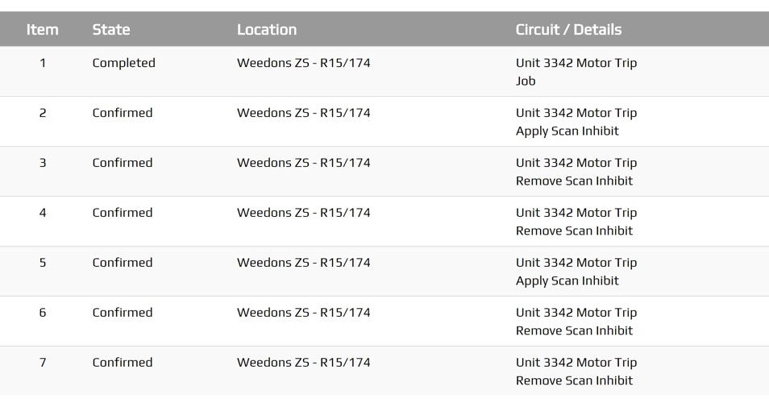

.. _tables_section:

==============
Tables Section
==============

Any plugin Screen will be able to use the :code:`.peek-tables-section` attributes.


Looks Classes
-------------

The Tables looks classes are found in the :file:`_tables_section.scss`.

.. _tables_section_tables_section:

Tables Section :code:`.peek-tables-section`
```````````````````````````````````````````



The :code:`.peek-tables-section` class contain the classes specific to a Tables
Section.

::

        .peek-tables-section{
        /* Contains the Tables Section looks classes */
            ...

            .table{
            /* Contains the table looks attributes unique to the Tables Section */
                ...

                .table-head{
                /* Contains the table header looks attributes unique to the .table class */
                    ...
                
                }
                .th{
                /* Contains the table head cell looks attributes unique to the .table class */
                    ...

                }
                .tr{
                /* Contains the table row looks attributes unique to the .table class */
                    ...

                }
                .td{
                /* Contains the table row cell looks attributes unique to the .table class */
                    ...

                }
            }
        }


Layout
------


HTML
````

The Tables Section HTML layout classes are found in the
:file:`_tables_section.web.scss`.


NativeScript
````````````

The Tables Section NativeScript layout classes are found in the
:file:`_tables_section.ns.scss`.


Code Extract
------------

Below is the HTML code extract of table header and first two rows from
:ref:`tables_section_tables_section`: ::

        <div class="peek-tables-section">
          <table class="table">
                  <tr class="table-head">
                      <th class="th">Item</th>
                      <th class="th">State</th>
                      <th class="th">Location</th>
                      <th class="th">Circuit / Details</th>
                  </tr>
                  <tr class="tr">
                      <td class="td">1</td>
                      <td class="td">Completed</td>
                      <td class="td">Weedons ZS - R15/174</td>
                      <td class="td">Unit 3342 Motor Trip
                          <br> Job</td>
                  </tr>
                  <tr class="tr">
                      <td class="td">2</td>
                      <td class="td">Confirmed</td>
                      <td class="td">Weedons ZS - R15/174</td>
                      <td class="td">Unit 3342 Motor Trip
                          <br> Apply Scan Inhibit</td>
                  </tr>
          </table>
        </div>
