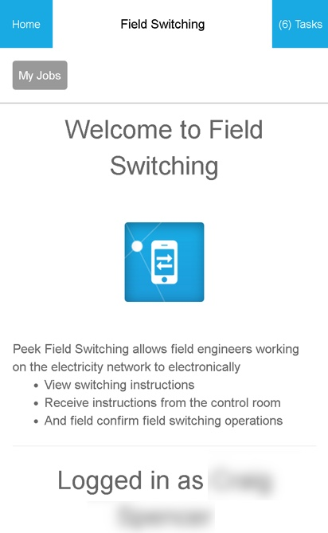

.. _information_section:

===================
Information Section
===================

The Information Section shows useful plugin related descriptions, information and / or
instructions.  This can include data from other plugins.

Ideally the Information Section is used as the landing page before presenting the plugin
screens. It could be used throughout a plugin if required.

The Information Section should provide the Peek App user any relevant information
needed to use a plugin.

Uses:

*  Initial landing page

*  Sub section landing page (instructions for part of a plugin that may function
   differently)

Any plugin Screen will be able to use the :code:`.peek-information-section` attributes.

Classes
-------

The :code:`.peek-information-section` class contain the classes specific to a Information
Section.

::

        .peek-information-section {
          /*
              Contains the Information Section classes
          */
          ...

          .information-section-icon {
            /*
                Contains the icon attributes unique to the peek-information-section class
            */
            ...

          }
          .information-section-title {
            /*
                Contains the title attributes unique to the peek-information-section class
            */
            ...

          }
        }

SCSS Files
----------

The Information style classes are found in the :file:`_information_section.scss`.

The Information Section HTML layout classes are found in the
:file:`_information_section.web.scss`.

The Information Section NativeScript layout classes are found in the
:file:`_information_section.ns.scss`.

HTML
----

::

        

            
Welcome to Field Switching

            

            
Peek Field Switching allows field engineers working on the
                electricity network to electronically
                <ul>
                    <li>View switching instructions</li>
                    <li>Receive instructions from the control room</li>
                    <li>And field confirm field switching operations</li>
                </ul>
            

            

            
Logged in as {{userDetails.displayName}}
            

        

NativeScript
------------

::

        <StackLayout class="peek-information-section">
            <Image class="information-section-icon"
                   src="~/assets/peek_plugin_pof_field_switching/plugin_icon.png"></Image>

            <label class="information-section-title"
                   text="Welcome to Field Switching"></label>
            <label class="p"></label>

            <label class="p"
                   textwrap="true"
                   text="Peek Field Switching allows field engineers working on the electricity network to electronically:"></label>
            <label class="p"></label>

            <label class="p" text="* View switching instructions"></label>
            <label class="p" text="* Receive instructions from the control room"></label>
            <label class="p" text="* And field confirm field switching operations"></label>
            <label class="p"></label>

            <label class="information-section-title"
                   text="Logged in as {{userDetails.displayName}}"></label>
        </StackLayout>

