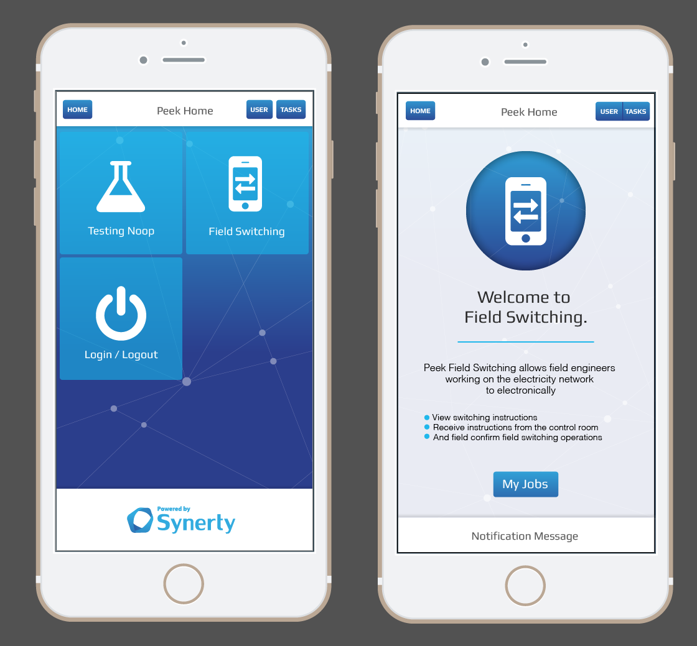

.. _overview:

========
Overview
========

The main aim of the Peek application is to display and transmit data. Plugins are
installed on the app and communicate with other plugins to retrieve, transmit, store or
display data.

What Is Peek TODO
------------

TODO

.. _overview_bootstrap:

Bootstrap
---------

The scss for the peek app is based upon bootstrap.  For more detail to
bootstrap documentation please visit `BootStrap <http://getbootstrap.com>`_.

The bootstrap classes that are related to the layouts will only work on HTML, not
NativeScript.  Therefore the theme will avoid selecting by bootstrap classes that are
related to layouts.

The looks and feel classes are to be used.  These will need to be styled from scratch
for NativeScript.

The scss will be structured in such a way to ignore hierarchy and tag selection.

.. note:: NativeScript does not use :ref:`overview_bootstrap` for layout.

.. _overview_nativescript:

NativeScript User Interface
---------------------------

`The user interface <https://docs.nativescript.org/ui/basics>`_ of NativeScript mobile
apps consists of pages. Typically, the design of the user interface is developed and
stored in XML files, styling is done via CSS and the business logic is developed and
stored in JavaScript or TypeScript files.
