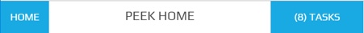

.. _title_bar:

=========
Title Bar
=========

The Title Bar is fixed to the top of the screen.

The buttons remain a fixed size throughout a responsive lifecycle.

Plugins can add buttons after the "Home" button on the left, or on the right of the
Title Bar.

The buttons on the right of the Title Bar will range from none to three.

The Title Bar will contain no more than four buttons.

The centralized title remains a single line and truncates a :code:`...` if the line
exceeds the minimum screen width.

The title has a fixed width of 40px.

The Title Bar is unique, therefore the classes used will be specific for the
Title Bar.

Classes
-------

The :code:`.peek-title-bar` class contains the classes specific to the Title Bar.

::

        .peek-title-bar{
        /* Contains the Title Bar classes */
            ...

            }
            .title-bar-btn{
            /* Contains the button attributes unique to the Title Bar */
                ...

            }
            .title-bar-title{
            /* Contains the title attributes unique to the Title Bar */
                ...

            }
        }
        .peek-page-contents{
        /* Contains the padding to stop the screens being covered by the title-bar */
            ...

        }

SCSS Files
----------

The Title Bar style classes are found in the
:file:`_title_bar.scss`.

The Title Bar HTML layout classes are found in the
:file:`_title_bar.web.scss`.

The Title Bar NativeScript layout classes are found in the
:file:`_title_bar.ns.scss`.

HTML
----

::

        

          

            <button class="title-bar-btn"
                    [routerLink]="['/']">
              Home

            </button>
          

          

            {{title}}

          

          

            <button class="title-bar-btn"
                    *ngFor="let link of rightLinks"
                    [routerLink]="[link.resourcePath]">
              {{linkTitle(link)}}

            </button>
          

        

NativeScript
------------

.. image:: ./title_bar.ns.jpg
  :align: center

::

        <GridLayout class="peek-title-bar"
                    [class.bg-danger]="!vortexIsOnline"
                    rows="auto" columns="auto, *, auto">

          <Button class="btn" col="0" row="0"
                  text="Home"
                  [nsRouterLink]="['/']">

          </Button>

          <Button class="btn"
                  *ngFor="let link of leftLinks"
                  col="0" row="0"
                  [text]="linkTitle(link)"
                  [nsRouterLink]="[link.resourcePath]">

          </Button>

          <Label class="title"
                 col="1" row="0"
                 [text]="title">

          </Label>

          <Button class="btn"
                  *ngFor="let link of rightLinks"
                  col="2" row="0"
                  [text]="linkTitle(link)"
                  [nsRouterLink]="[link.resourcePath]">

          </Button>
        </GridLayout>
