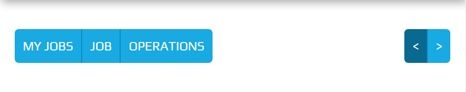

.. _navigation_bar:

==============
Navigation Bar
==============

Navigation Bar is dynamic and exists if required by the plugin.  The contents of the
Navigation Bar is constructed from the plugin.

The Navigation Bar is located below the :ref:`title_bar`, above the screen.

The buttons remain a fixed size throughout a responsive lifecycle.  The buttons are
sized around the text they contain.

.. note:: The buttons require a different theme to the :ref:`title_bar`.


Looks Classes
-------------

The :code:`.btn-group`, :code:`.btn` and :code:`.nav-tabs` classes will not have a
hierarchy
and will be used throughout Peek.  These looks classes attribute changes are found in
:file:`_bootstrap_adjustments.scss`.


HTML Layout
-----------

The Navigation Bar HTML layout classes are found in the
:file:`_navigation_bar.web.scss`.


Display Samples
---------------


Buttons
```````

The following example shows a button group :code:`.btn-group` on the left and a button
group on the right.

HTML: ::

        <div class="btn-group pull-left" role="group" aria-label="">
            <button class="btn" role="group" aria-label="">My Jobs</button>
            <button class="btn" role="group" aria-label="">Job</button>
            <button class="btn" role="group" aria-label="">Operations</button>
        </div>
        <div class="btn-group pull-right" role="group" aria-label="">
            <button class="btn" role="group" aria-label="">&lt;</button>
            <button class="btn" role="group" aria-label="">&gt;</button>
        </div>




The following example shows a button group on the left.

HTML: ::

        <div class="btn-group" role="group" aria-label="">
            <button class="btn">My Jobs</button>
            <button class="btn">&lt; Job J-5102-C</button>
        </div>


The following example shows a button :code:`.btn` on the left.

HTML: ::

        <button class="btn">New Chat</button>


.. image:: ./navigation_bar-plugin_chat_list.web.jpg
