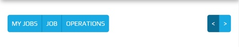

.. _screen_navigation:

===============
Screen Navigation
===============

Screen Navigation is dynamic and exists if required by the plugin.  The contents of the
Screen Navigation is constructed from the plugin.

The Screen Navigation is located below the :ref:`title_bar`, above the screen.

The buttons remain a fixed size throughout a responsive lifecycle.  The buttons are
sized around the text they contain.

.. note:: The buttons require a different theme to the :ref:`title_bar`.


Looks Classes
-------------

The :code:`.btn-group` and :code:`.btn` classes will not have a hierarchy and will be
used throughout Peek.  These looks classes attribute changes are found in
:file:`_bootstrap_adjustments.scss`.


Layout
------


HTML Layout
```````````

The Screen Navigation HTML layout classes are found in the
:file:`_screen_navigation.web.scss`.


Display Sample
``````````````

The following image shows a button group :code:`.btn-group` on the left and a button
group on the right.



The following image shows a button group on the left.

.. image:: ./screen_navigation-table_data_screen.web.jpg
  :align: center

The following image shows a button :code:`.btn` on the left.


