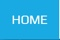
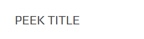

.. _title_bar:

=========
Title Bar
=========

The Title Bar is fixed to the top of the screen.

The buttons remain a fixed size throughout a responsive lifecycle.

Plugins can add buttons after the "Home" button on the left, or on the right of the
Title Bar.

The buttons on the right of the Title Bar will range from none to three.

The Title Bar will contain no more than four buttons.

The centralized title remains a single line and truncates a :code:`...` if the line
exceeds the minimum screen width.

The title has a fixed width of 40px.

The Title Bar is unique, therefore the classes used will be specific for the
Title Bar.


Looks Classes
-------------

The Title Bar looks classes are found in the :file:`_title_bar.scss`.


Title Bar :code:`.peek-title-bar`
`````````````````````````````````


HTML
~~~~

.. image:: ./title_bar.web.jpg
  :align: center

NativeScript
~~~~~~~~~~~~

.. image:: ./title_bar.ns.jpg
  :align: center

The :code:`.peek-title-bar` class contains the looks classes specific to the Title Bar.

::

        .peek-title-bar{
        /* Contains the Title Bar looks classes */
            ...

            .btn{
            /* Contains the button looks attributes unique to the Title Bar */

                ...

            }
            .title{
            /* Contains the title looks attributes unique to the Title Bar */

                ...

            }
        }


HTML
~~~~

::

        <div class="peek-title-bar">
            ...

        </div>


NativeScript
~~~~~~~~~~~~

::

        <GridLayout class="peek-title-bar">
            ...

        </GridLayout>


Button :code:`.btn`
```````````````````

The :code:`.btn` class dictates the style and size of all the buttons in the Title Bar.
These buttons are unique to the Title Bar.

HTML
~~~~



::

        <button class="btn">
            Home

        </button>


NativeScript
~~~~~~~~~~~~

::

        <Button class="btn"
                text="Home">

        </Button>


Title :code:`.title`
````````````````````

The :code:`.title` class styles the dynamic title.  Plugins will update the title text.

HTML
~~~~



::

        <div class="title">
            ...

        </div>


NativeScript
~~~~~~~~~~~~

::

        <Label class="title"
               [text]="...">

        </Label>


Layout
------


HTML
````

The Title Bar HTML layout classes are found in the :file:`_title_bar.web.scss`.


NativeScript
````````````

The Title Bar NativeScript layout classes are found in the
:file:`_title_bar.ns.scss`.
