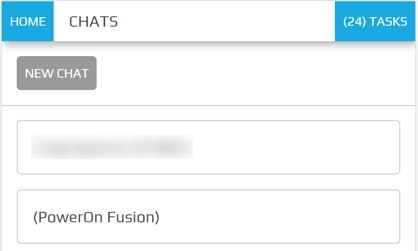
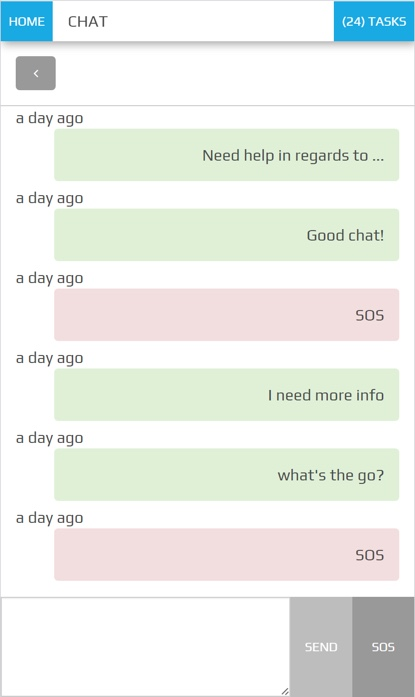

.. _peek_plugin_chat:

==============================
Peek Plugin Chat Style Example
==============================

Peek Plugin Chat displays active chat sessions and their messages.

*  The active chat sessions should indicate if there are unread messages.

*  The message lists will display sent messages on the right and received messages on
   the left.

*  Background contextual colours will distinguish a successfully sent message or an
   emergency "SOS" message received.

Chats:



Messages:



Originally this plugin was designed to send messages between the power grid control
room and field engineers.

Simple communications with external systems.

Components
----------

The **chat-list** component displays a list of active chat sessions that route to the
msg-list component.
The "New Chat" button in the Navigation Bar routes to the new-chat component.

The **new-chat** component creates new chat sessions.
The user builds a list of one or more users for a new chat session.

The **msg-list** component shows the list of sent and received messages for the
selected chat session.
The "angle-left" button in the Navigation Bar routes to the chat-list component.
The user has the option to compose a new message to send of send an "SOS" message.


Classes
-------

The :code:`.plugin-chat-list` class contain the classes specific to the
chat-list component.
The :code:`.plugin-chat-messages` class contains the classes specific to the msg-list
component.
The new-chat component uses generic classes, see :ref:`other_useful_styles`.

::

        .plugin-chat-list {
          /*
              Contains the chat-list component classes
          */
          ...

          .chat-list-messages {
            /*
                Contains the Messages attributes unique to the Chat List
            */
            ...

            .chat-list-icon {
              /*
                  Contains the icon attributes unique to the message class
                  The icon is used to indicate unread messages
              */
              ...

            }
            .chat-list-title {
              /*
                  Contains the topic text attributes unique to the message class
              */
              ...

            }
          }
        }

        .plugin-chat-messages {
          /*
              Contains the msg-list component classes
          */
          ...

          .chat-messages-list {
            /*
                Attributes for the container of messages, unique to the Chat
                Messages.
                Scrolls through the messages with most recent at the bottom.
            */
            ...

            .chat-messages-sent {
              /*
                  Contains the sent message attributes unique to the message-list
                  class.
                  Container is right aligned with background colour different to the
                  received class.
                  bg-success class applied for a successfully sent message.
              */
              ...

            }
            .chat-messages-received {
              /*
                  Contains the received text attributes unique to the message-list
                  class.
                  Container is right aligned with background colour different to the
                  sent class.
                  bg-warning class applied for an emergency priority message.
              */
              ...

            }
            .chat-messages-details {
              /*
                  Contains the message details text attributes unique to the
                  message-list class.
                  The message details should not be the focus of attention (text-muted)
              */
              ...

            }
            .chat-messages-emergency {
              /*
                  Contains the emergency priority message text attributes unique to the
                  message-list class
              */
              ...

            }
            .chat-messages-normal {
              /*
                  Contains the normal priority message text attributes unique to the
                  message-list class
              */
              ...

            }
          }
          .chat-messages-compose {
            /*
                Contains the compose message area attributes unique to the
                chat messages.
                Fixed to the bottom of the screen.
            */
            ...

            .chat-messages-new-text {
              /*
                  Contains the new message text attributes unique to the
                  chat-messages-compose class.
              */
              ...

            }
          }
        }
        .chat-messages-btn-group {
            ...

          .chat-messages-btn {
            /*
                Contains the button attributes unique to the
                chat-messages-compose class.
            */
            ...

          }
        }


SCSS Files
----------

The Inbox style classes are found in the :file:`_plugin_chat.scss`.

The Inbox HTML layout classes are found in the
:file:`_plugin_chat.web.scss`.

The Inbox NativeScript layout classes are found in the
:file:`_plugin_chat.ns.scss`.


HTML
----


chat-list component
```````````````````

::

        <!--TRANSITION WITH REASON DIALOG -->
        <pl-chat-new-chat
                *ngIf="isNewChatDialogShown()"
                (create)="dialogConfirmed($event)"
                (cancel)="dialogCanceled()"
                [data]="newChatDialogData">

        </pl-chat-new-chat>


        <div class="peek-nav-section">
            <!--
                The following 'div' groups button to the left of the Nav Bar.
                Can contain one to many buttons
            -->
            <div class="btn-group pull-left"
                 *ngIf="!isNewChatDialogShown()"
                 role="group">
                <button class="btn"
                        role="group"
                        (click)="newChatClicked()">
                    New Chat
                </button>
            </div>
        </div>

        <div class="plugin-chat-list">
            <!-- Use the template tag syntax, as this works with nativescript too -->
            <ng-template ngFor let-chat [ngForOf]="chats" let-i="index">
                <div class="chat-list-messages" (click)="chatClicked(chat)">

                    <!-- Unread indicator -->
                    <fa class="chat-list-icon" name="fw" *ngIf="isChatRead(chat)"></fa>
                    <fa class="chat-list-icon" name="comment-o" *ngIf="!isChatRead(chat)"></fa>

                    <!-- Other Users -->
                    <div class="chat-list-title" *ngFor="let user of otherChatUsers(chat)">
                        {{userDisplayName(user)}} ({{user.userId}})
                    </div>
                </div>
            </ng-template>
        </div>


new-chat component
``````````````````

::

        <div [@dialogAnimation]="dialogAnimationState"
             (@dialogAnimation.done)="animationDone($event)">

            <div class="h2">
                Start a chat wth :
            </div>

            <div class="p"
                 *ngIf="!createButtonEnabled()">
                No users selected
            </div>
            <ul>
                <li *ngFor="let u of data.users">
                    {{u.displayName}}
                </li>
            </ul>

            <div class="form-group">
                <label class="h4"
                       for="userIdField">
                    Add User:
                </label>
                <select class="form-control"
                        id="userIdField"
                        name="userId"
                        [(ngModel)]="selectedUserIndex">
                    <option [value]="i" *ngFor="let i = index; let item of usersStrList">
                        {{item}}
                    </option>
                </select>
            </div>


            <!-- BEGIN HANDBACK DIALOG -->
            <div>
                <Button class="btn" (click)="addUserClicked()"
                        [disabled]="!newButtonEnabled()">
                    Add User
                </Button>

                <Button class="btn" (click)="confirmClicked(false)"
                        [disabled]="!createButtonEnabled()">
                    Create Chat
                </Button>

                <Button class="btn" (click)="cancelClicked(false)">
                    Cancel
                </Button>
            </div>
        </div>

msg-list component
``````````````````

::

        <div class="peek-nav-section">
            <div class="btn-group pull-left"
                 role="group">
                <button class="btn"
                        role="group"
                        (click)="navToChatsClicked()">
                    <fa name="angle-left"></fa>
                </button>
            </div>
        </div>

        <div class="plugin-chat-messages"
             #messageListRef>
            <!-- No Messages -->
            <div class="h3"
                 *ngIf="!haveMessages()">
                No messages

            </div>
            <div class="chat-messages-list">

                <div *ngFor="let i=index; let msg of messages()">
                    <!-- Unread marker -->
                    <hr *ngIf="isFirstUnreadMesage(i)"/>

                    <!-- From and Date -->
                    <div [class.sent]="isMessageFromThisUser(msg)"
                         [class.received]="!isMessageFromThisUser(msg)">
                        <div class="chat-messages-details"
                             *ngIf="!isMessageFromThisUser(msg)">
                            From {{userDisplayName(msg)}} ({{msg.fromUserId}}), {{timePast(msg)}}
                            ago

                        </div>
                        <div class="chat-messages-details"
                             *ngIf="isMessageFromThisUser(msg)">
                            {{timePast(msg)}} ago

                        </div>
                        <div [class.chat-messages-sent]="isMessageFromThisUser(msg)"
                             [class.chat-messages-received]="!isMessageFromThisUser(msg)"
                             [class.bg-success]="isNormalPriority(msg)"
                             [class.bg-danger]="isEmergencyPriority(msg)">

                            <div class="chat-messages-normal"
                                 *ngIf="isNormalPriority(msg)">
                                {{msg.message}}

                            </div>
                            <div class="chat-messages-emergency"
                                 *ngIf="isEmergencyPriority(msg)">
                                {{msg.message}}

                            </div>
                        </div>
                    </div>
                </div>
            </div>

            <div class="chat-messages-compose">
            <textarea class="form-control"
                      [(ngModel)]="newMessageText">

            </textarea>
                <button class="btn" type="button"
                        [disabled]="!sendEnabled()"
                        (click)="sendMsgClicked()">
                    Send

                </button>
                <button class="btn" type="button"
                        (click)="sendSosClicked()">
                    SOS

                </button>
            </div>
        </div>
