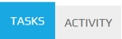
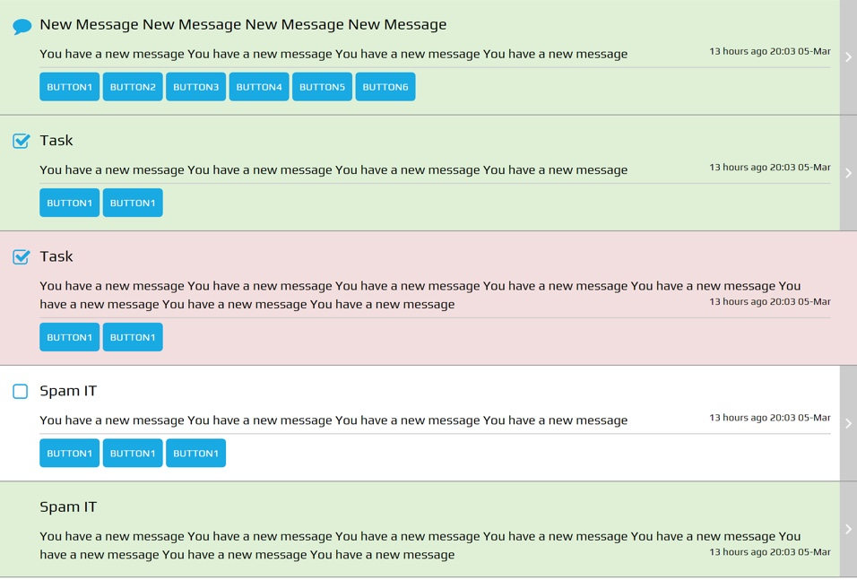
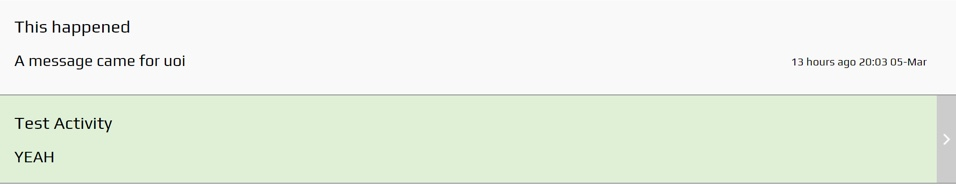

.. _peek_plugin_inbox:

=================
Peek Plugin Inbox
=================

Peek Plugin Inbox displays a list of tasks to be actioned and an activity list log for
plugins that have been configured.

*  The Inbox Screen is accessed by the 'Tasks' button in the Title Bar.

*  The 'Tasks' button also shows the number of tasks.

*  Tabs switch between the components that list items from installed plugins that are
   configured to pass items into the peek-plugin-inbox.

*  The items can use icons, buttons and routing, all configurable.

*  Background contextual colours and icons can be used to distinguish between levels of
   importance or priority.


Components
----------

The **plugin-active-task-client** component builds the navigation tabs.
The tabs route to the components plugin-active-task-task-list and
plugin-active-task-activity-list.

The **plugin-active-task-task-list** component builds rows of outstanding tasks from
plugins configured to issue tasks.

The **plugin-active-task-activity-list** component builds rows of the activity from the
plugins configured to show activity.


Classes
-------

The :code:`.plugin-inbox` class contains the classes specific to the
Peek Plugin Active Task.

::

        .plugin-inbox{
        /*
            Contains the peek-plugin-inbox screen classes
        */
            ...

            .inbox{
            /* 
                Contains the style and classes for the inbox container
            */
                ...

                .inbox-item{
                /*
                    Contains the style and classes for the
                */
                    ...

                    .inbox-icon{
                    /*
                        Contains the icon attributes unique to the .inbox-item class
                    */
                        ...

                    }
                    .inbox-info{
                    /*
                        Contains the info attributes unique to the .inbox-item class
                    */
                        ...

                        .inbox-title{
                        /*
                            Contains the title text attributes unique to the .inbox-info class
                        */
                            ...

                        }
                        .inbox-description{
                        /*
                            Contains the description text attributes unique to the .inbox-info class
                        */
                            ...

                        }
                        .inbox-date-time{
                        /*
                            Contains the date and time attributes unique to the .inbox-info class
                        */
                            ...

                        }
                    }
                    .inbox-read-more{
                    /*
                        Contains the read more link attributes unique to the .plugin-inbox class
                    */
                        ...

                    }
                }
            }
        }


SCSS Files
----------

The Inbox style classes are found in the
:file:`_plugin_inbox.scss`.

The Inbox HTML layout classes are found in the
:file:`_plugin_inbox.web.scss`.

The Inbox NativeScript layout classes are found in the
:file:`_plugin_inbox.ns.scss`.


HTML
----


plugin-active-task-client
`````````````````````````



::

        <div class="plugin-inbox">

            <ul class="nav nav-tabs"
                role="tablist">
                <li class="active"
                    role="presentation">
                    <a aria-controls="home"
                       data-toggle="tab"
                       href="http://localhost:4200/#inboxTasks"
                       role="tab">
                        Inbox

                    </a>
                </li>
                <li role="presentation">
                    <a aria-controls="profile"
                       data-toggle="tab"
                       href="http://localhost:4200/#inboxActivity"
                       role="tab">
                        Activity

                    </a>
                </li>
            </ul>
            <div class="tab-content">
                <div class="tab-pane active"
                     role="tabpanel"
                     id="inboxTasks">
                    <plugin-active-task-task-list></plugin-active-task-task-list>

                </div>
                <div class="tab-pane"
                     role="tabpanel"
                     id="inboxActivity">
                    <plugin-active-task-activity-list></plugin-active-task-activity-list>

                </div>
            </div>
        </div>


plugin-active-task-task-list
````````````````````````````



::

        <div class="inbox-tasks">
            <div class="h3"
                 *ngIf="tasks.length === 0">
                The inbox is empty.

            </div>
            <div class="inbox-item bg-success"
                 *ngFor="let task of tasks"
                 (click)="taskClicked(task)">
                <div class="inbox-icon">
                    <i class="fa fa-comment"
                       aria-hidden="true"></i>

                </div>
                <div class="inbox-info">
                    <div class="inbox-title">
                        {{task.title}}

                    </div>
                    <div class="inbox-description">
                        {{task.description}}

                    </div>
                    <div class="inbox-date-time">
                        {{timePast(task)}} ago, {{dateTime(task)}}

                    </div>
                </div>
                <div class="btn inbox-read-more">
                    <i class="fa fa-chevron-right"
                       aria-hidden="true"></i>

                </div>
            </div>
        </div>


plugin-active-task-activity-list
````````````````````````````````



::

        <div class="inbox-activity">
            <div class="message"
                 *ngIf="activities.length === 0">
                There is no recent activity.

            </div>
            <div class="inbox-item"
                 *ngFor="let activity of activities"
                 (click)="activityClicked(activity)">
                <div class="inbox-info">
                    <div class="inbox-title">
                        {{activity.title}}

                    </div>
                    <div class="inbox-description">
                        {{activity.description}}

                    </div>
                    <div class="inbox-date-time">
                        {{timePast(activity)}} ago, {{dateTime(activity)}}

                    </div>
                </div>
                <div class="btn inbox-read-more">
                    <i class="fa fa-chevron-right"
                       aria-hidden="true"></i>

                </div>
            </div>
        </div>
