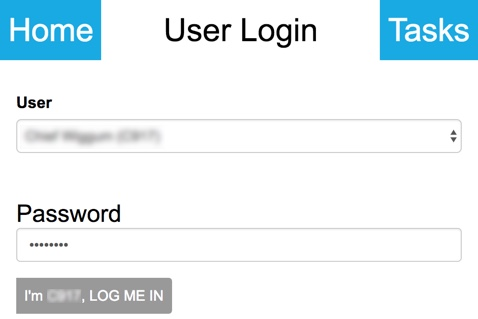
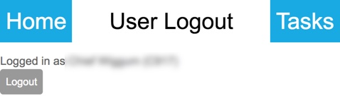

.. _peek_plugin_user:

================
Peek Plugin User
================

Peek Plugin User displays the logged in user and a button for logging out.
If no user is logged in, a list of configured users are available to select
from and a password text box.

*  Indicates if a user is logged in.

*  User can logout or login.

:Login:



:Logout:



peek-plugin-user can be configured to have users credentials stored locally or
authenticate via an external source using the peek-agent service.

Components
----------

The **user-login** component displays a list of available users.
The "Login" button at the bottom left authenticates the user name and password.

The **user-logout** displays the current logged in user.
The "Logout" button at the bottom left logs out the user.

Classes
-------

The :code:`.plugin-user` class contains the peek-plugin-user classes.

::

        .plugin-user {
          /*
              Contains the user component classes
          */
          ...

        }


SCSS Files
----------

The User style classes are found in the :file:`_plugin_user.scss`.

The User HTML layout classes are found in the
:file:`_plugin_user.web.scss`.

The User NativeScript layout classes are found in the
:file:`_plugin_user.ns.scss`.


HTML
----


user-login component
````````````````````

::

        <div class="plugin-user">
            <form autocomplete="off" novalidate>
                <fieldset [disabled]="isAuthenticating">
                    ...

                </fieldset>
                <button class="btn" (click)="doLogin()"
                        [disabled]="isAuthenticating">
                    {{loginText()}}
                </button>
            </form>
        </div>


user-logout component
`````````````````````

::

        <div class="plugin-user">
            <div class="p">Logged in as {{loggedInUserText()}}</div>

            <form autocomplete="off" novalidate>
                <button class="btn" (click)="doLogout()"
                        [disabled]="isAuthenticating">
                    Logout
                </button>
            </form>
        </div>

