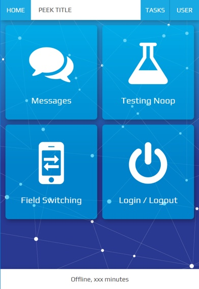
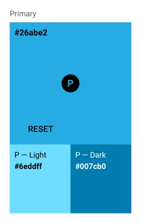
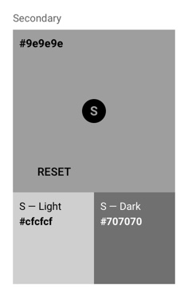

.. _style_guide:

===========
Style Guide
===========


Design Objective
----------------

The objective of this project is to stylise the existing layout to make it very
impressive without changing the HTML / javascript of a page to a large extent. The job
mainly involves CSS/SCSS upgrade to the base Bootstrap theme.

This app will be viewed predominately during the day. The design and layout must be
clear to read in very bright sunlight.




Design Overview
---------------

.. image:: ./design-layouts-PeekUI.jpg


Design requirements
```````````````````

#.  Data must be

    #.  Readable in daylight

    #.  Without transparent backgrounds

#.  Large icons with text in the icons on home page

#.  Home page icons need to be more like apple icons

#.  Home page design must be impressive

#.  All screens do not need to have the same background

#.  Other screens must have static background to avoid distractions

#.  Use Nodal background as used in Peek App Branding

#.  Each icon on the home screen represents and App / Plugin and the background image
    for each App can change when a user clicks into it, hence having its own subtle
    branding but still share allot of common elements in the entire app.


Design restrictions
```````````````````

#.  Design must not be dark or have a dark background


Colours
-------

A *primary colour* refers to a colour that appears most frequently in your app.

A *secondary colour* refers to a colour used to accent key parts of your UI.

The primary and secondary colours have been selected to ensure sufficient colour contrast between elements so that
all users can see and use the app.


Primary Colour (Brand)
``````````````````````

A primary colour is the color displayed most frequently across your app’s screens and components.
It can also be used to accent elements,
if you don’t have a secondary color.

To create contrast between elements, you can use lighter or darker tones of your primary color.
The contrast between lighter and darker tones helps show division between surfaces,
such as between the status bar and a toolbar.



Secondary Colour
````````````````

A secondary colour is used to accent select parts of your UI.
It can be complementary or analogous to your primary colour,
but it should not simply be a light or dark variation of your primary colour.
It should contrast with elements that surround it and be applied sparingly as an accent.

Secondary colours are best used for:

*  Buttons, floating action buttons, and button text

*  Text fields, cursors, and text selection

*  Progress bars

*  Selection controls, buttons, and sliders

*  Links

* Headlines




Typography
----------

Font
````

Source (Google fonts): `Play <https://fonts.google.com/specimen/Play>`_

Colours and Contrast
````````````````````

A text colour that is too similar to the background colour is hard to read.
Text with too much contrast can also be hard to read.
This is especially true of light-coloured text against dark backgrounds.

Text on the primary, primary-dark, secondary or secondary-dark will be coloured **white** :code:`#ffffff`.

As a general rule of thumb in the Peek application text displaying data is coloured **black** :code:`#000000`
to draw focus, text displaying information is coloured **secondary-dark** :code:`#707070` to avoid taking away
focus from the displayed data.


Layout
------

Peek plugins can consist of the following:

*  :ref:`navigation_section`, located at the top of the screen.  Within the :ref:`navigation_section`
   Navigation buttons are grouped together and located on the left of the screen.
   Action buttons are grouped located to the right of the screen.
   Previous and Next buttons are grouped with and located to the right of the action buttons.

|

*  :ref:`mobile_dialog_section`, appears from the top of the screen and the navigation section should be hidden
   while the :ref:`mobile_dialog_section` is active.

|

*  :ref:`information_section`, the landing screen of a plugin used to describe and display required information on
   opening the plugin such as active user.

|

*  :ref:`details_section`, presents data (text, numbers, images, or other data) of importance.

|

*  :ref:`tables_section`, best suited when there's logical relationships among text, numbers, images, or
   other data exist in two dimensions (vertical and horizontal).

The Peek plugin contents will always be display between the header at the top and footer at the bottom.

.. note:: Customising plugins layout outside of the guides directions is up to the developer.


Components
----------

:TODO:

Header dynamic buttons

Footer dynamic buttons

Patterns
--------

:TODO:

Confirming an action to be completed with the :ref:`mobile_dialog_section`.


Platform
--------

Design conventions can differ from platform to platform.
These differences in convention can affect the user's ability to understand the UI or complete certain tasks.

Peek is to be designed to function identically across all platforms.


Operating system
````````````````

iOS, Android and Web.

Future development: Microsoft app.


Devices
```````

The application has been developed for screens of a resolution greater than, 1136 x 640
pixels.  This is the iPhone 5 resolution.

.. note:: The application will function on devices with lower resolution but may not
  display correctly.
