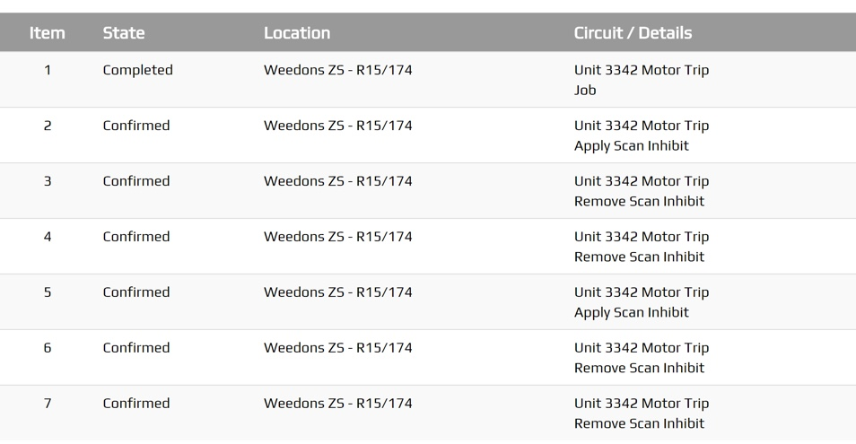

.. _tables_section:

==============
Tables Section
==============

The Tables Section is best suited when there's logical relationships among text,
numbers, images, or other data exist in two dimensions (vertical and horizontal).
These relationships are represented in columns and rows, and the columns and rows must
be recognizable in order for the logical relationships to be perceived.

Useful for viewing detailed data and precise values, good for comparing individual values.

The objective of this technique is to present tabular information in a way that
preserves relationships within the information.

*  Filter or sort data

*  Show exact data

*  Visualise single or two dimensional data.

Any plugin Screen will be able to use the :code:`.peek-tables-section` attributes.

Classes
-------

The :code:`.peek-tables-section` class contain the classes specific to a Tables
Section.

::

        .peek-tables-section{
        /* Contains the Tables Section classes */
          ...

          .table{
          /* Contains the table attributes unique to the Tables Section */
            ...
          }

          .tr{
          /* Contains the table row attributes unique to the .table class */
            ...

          }
          .th{
          /* Contains the table head cell attributes unique to the .table class */
            ...

          }
          .td{
          /* Contains the table row cell attributes unique to the .table class */
            ...

          }

          .bg-odd {
          /* 
            Applies the table even rows background theme
            This class also exists inside the .bg-... classes found in :ref:`other_useful_styles`.
          */
              ...

          }
        }

SCSS Files
----------

The Tables style classes are found in the
:file:`_tables_section.scss`.

The Tables Section HTML layout classes are found in the
:file:`_tables_section.web.scss`.

The Tables Section NativeScript layout classes are found in the
:file:`_tables_section.ns.scss`.

HTML
----

The Tables Section uses Bootstraps `Tables <http://getbootstrap.com/css/#tables>`_.

Below is the HTML code extract of table header and two rows from
:ref:`tables_section`: ::

        

            

                <thead>
                <tr class="tr">
                    <th class="th">ID</th>
                    <th class="th">Name</th>
                    <th class="th">Scheduled Date</th>
                    <th class="th">Status</th>
                </tr>
                </thead>
                <tbody>
                <tr class="tr"
                    *ngFor="let item of incidents; odd as odd"
                    [class.bg-primary]="item.fieldStatus.isActive"
                    [class.bg-warning]="item.fieldStatus.isDispatched"
                    [class.bg-success]="item.fieldStatus.isAccepted"
                    (click)="jobClicked(item)">
                    <td class="td"
                        [class.bg-odd]="odd" [class.bg-even]="even">
                        {{item.jobNumber}}

                    </td>
                    <td class="td"
                        [class.bg-odd]="odd" [class.bg-even]="even">
                        {{item.jobName}}

                    </td>
                    <td class="td"
                        [class.bg-odd]="odd" [class.bg-even]="even">
                        {{item.scheduledDate
                        | date:'HH:mm EE dd-MMM'}}

                    </td>
                    <td class="td"
                        [class.bg-odd]="odd" [class.bg-even]="even">
                        {{item.fieldStatus.niceName}}

                    </td>
                </tr>
                </tbody>
            

        

NativeScript
------------

The Tables Section uses `Listview <https://docs.nativescript.org/ui/list-view>`_.

Below is the NativeScript code extract of table header and two rows from
:ref:`tables_section`: ::

        <StackLayout class="peek-tables-section">
            <StackLayout class="table">
                <GridLayout rows="auto" columns="2*, 3*, 2*">
                    <Label class="th" row="0" col="0" text="Job"></Label>
                    <Label class="th" row="0" col="1" text="Scheduled"></Label>
                    <Label class="th" row="0" col="2" text="Status"></Label>
                </GridLayout>

                <GridLayout rows="*" columns="*">
                    <ListView [items]="jobs">
                        <ng-template let-item="item" let-i="index" let-odd="odd" let-even="even">
                            <StackLayout
                                    [class.bg-primary]="item.fieldStatus.isActive"
                                    [class.bg-info]="item.fieldStatus.isAccepted"
                                    [class.bg-success]="item.fieldStatus.isDispatched"
                                    (tap)="jobClicked(item)">
                                <GridLayout rows="2*,2*,*" columns="2*, 3*, 2*"
                                            class="tr"
                                            [class.bg-odd]="odd" [class.bg-even]="even">
                                    <!-- Details -->
                                    <Label row="0" col="0"
                                           class="td"
                                           [text]="item.jobNumber"></Label>
                                    <Label row="0" col="1"
                                           class="td"
                                           [text]="item.scheduledDate | date:'HH:mm EE dd-MMM'"></Label>
                                    <Label row="0" col="2"
                                           class="td"
                                           [text]="item.fieldStatus.niceName"></Label>
                                    <!-- Description -->
                                    <Label row="1" col="0" colSpan="3"
                                            class="td"
                                           [text]="item.jobName" textWrap="true"></Label>
                                </GridLayout>
                            </StackLayout>
                        </ng-template>
                    </ListView>
                </GridLayout>
            </StackLayout>
        </StackLayout>

.. note:: For the ListView to fill the screen space it is required to be the child of a GridLayout.
   Star mode for GridLayout row and column means that child ListView will expand to fill the gap left from other
   elements in the screen.
