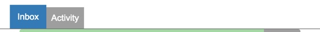

.. _tabs_section:

============
Tabs Section
============

The Tabs Section is positioned below the :ref:`title_bar`, below the :ref:`navigation_section`, above the plugin
screen and contains buttons that route to other tab contents toggling the data presented.

The sample below shows an example of tab navigation of the inbox plugin.  The 'Inbox' is presented as the active tab
and the 'Activity' is presented as the inactive tab.

The Tabs Section serves as screen content control.

If a Tabs Section is required it is constructed by the plugin screen.

The buttons remain a fixed size throughout a responsive lifecycle.  The buttons are
sized around the text they contain.  The active tab button uses the primary colour styling and is slightly taller
than the selectable inactive tab button.

.. note:: The buttons require a different theme to the :ref:`title_bar` and generic
   peek theme buttons.

Classes
-------

The :code:`.peek-tabs-section` class contains the looks classes specific to the
Tabs Section.

 ::

      .peek-tabs-section {
        /* Contains the Tabs Section attributes */
            ...

        .btn-group {
          /* Contains the attributes unique to the Tabs Section */

          .tabs-section-btn {
            /* Contains the Button attributes unique to the Tabs Section */

                ...

          }
          .tabs-section-btn.active {
            /* Contains the Button attributes for the active tab unique to the Tabs Section */
                ...

          }
          .tabs-section-btn-divider {
            /* Contains the button divider attributes unique to the Tabs Section */
                ...

          }
          .tabs-section-btn-disabled {
            /* Contains the button disabled attributes unique to the Tabs Section */
                ...

          }
        }
      }

      .peek-tabs-bar-padding {
        /* Provides padding for the screen under the Tabs Section */
            ...

      }

SCSS Files
----------

The Tabs Section style classes are found in the
:file:`_tabs_section.scss`.

The Tabs Section HTML layout classes are found in the
:file:`_tabs_section.web.scss`.

The Tabs Section NativeScript layout classes are found in the
:file:`_tabs_section.ns.scss`.

HTML
----

The :code:`peek-tabs-section` is to be included before the code of the plugin screen
requiring Tabs.

The :code:`tabs-section-btn-divider` and :code:`tabs-section-btn-disabled` classes are not required in the **Web app**.
Their attributes are handled by *pseudo-selectors* of :code:`tabs-section-btn`.

 ::

        

            

                <Button class="tabs-section-btn"
                        [class.active]="barIndex == 0"
                        (click)="barIndex = 0">
                    Inbox
                </Button>
                <Button class="tabs-section-btn"
                        [class.active]="barIndex == 1"
                        (click)="barIndex = 1">
                    Activity
                </Button>
            

        

NativeScript
------------

The :code:`peek-tabs-section` is to be included before the code of the plugin screen
requiring Tabs.

The :code:`tabs-section-btn-divider` and :code:`tabs-section-btn-disabled` classes are **required** in the
*NativeScript* app.  *Pseudo-selectors* applied in the **SCSS** are not supported by *NativeScript*.

:code:`tabs-section-btn-divider` will set the right side border of the button.

:code:`tabs-section-btn-disabled` applies the disabled styling.

 ::

        <StackLayout class="peek-tabs-section">
            <GridLayout class="btn-group" rows="auto" columns="auto, auto, *">
                <Button row="0" col="0"
                        class="tabs-section-btn"
                        [class.active]="barIndex == 0"
                        text="Inbox"
                        (tap)="barIndex = 0"></Button>
                <Button row="0" col="1"
                        class="tabs-section-btn"
                        [class.active]="barIndex == 1"
                        text="Activity"
                        (tap)="barIndex = 1"></Button>
            </GridLayout>
        </StackLayout>

